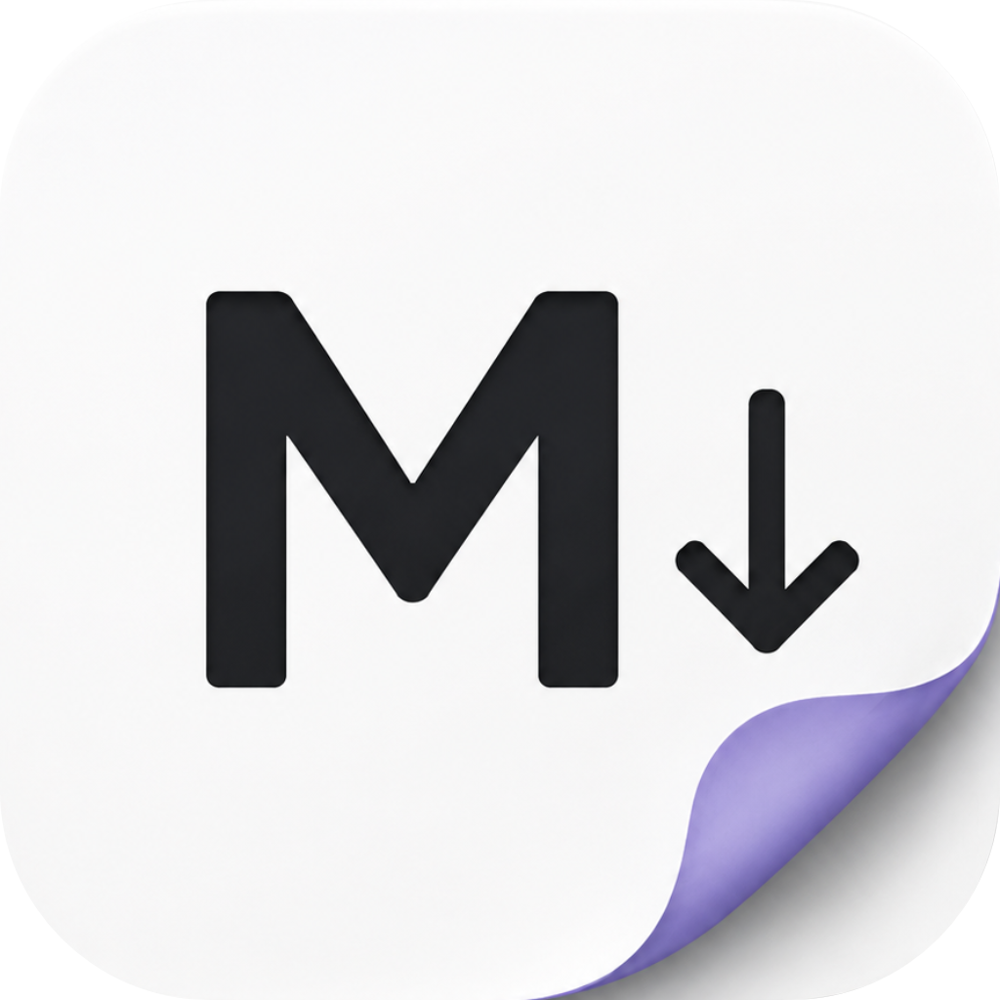
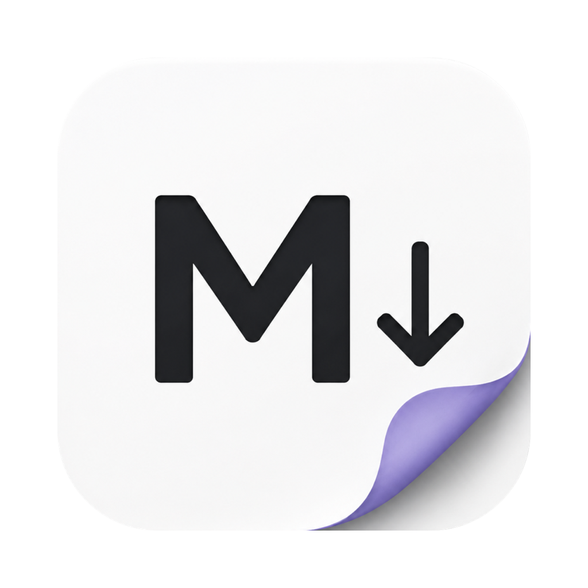

<div align="center">



# Mark

### A lightweight native macOS Markdown editor with a GitHub-style live preview.

<p>
  <a href="https://github.com/alisoncardosoo/mark">
    
  </a>
  
  
  
</p>

<p>
  <a href="https://github.com/alisoncardosoo/mark/stargazers">
    
  </a>
  <a href="https://github.com/alisoncardosoo/mark/network/members">
    
  </a>
  <a href="https://github.com/alisoncardosoo/mark/issues">
    
  </a>
  
  
  
</p>

</div>

---

## Index

- [About](#about)
- [Project Status](#project-status)
- [Features](#features)
- [Visual Preview](#visual-preview)
- [Access](#access)
- [Installation](#installation)
- [Technologies](#technologies)
- [Architecture](#architecture)
- [Security](#security)
- [Roadmap](#roadmap)
- [Contributing](#contributing)
- [Author](#author)
- [License](#license)

## About

**Mark** is a fast, practical and native macOS Markdown editor inspired by the simplicity of apps like MacDown, but built from scratch with modern SwiftUI and AppKit integration.

The goal is simple: make reading and editing `.md` files feel natural on macOS. Instead of forcing users to choose between raw source code and rendered output, Mark combines a text editor, a GitHub-Flavored Markdown preview and a focused reading mode in one clean desktop experience.

Mark is designed for:

- Developers writing README files, docs and technical notes.
- Makers who want a lightweight Markdown viewer without Electron.
- macOS users who prefer native performance, system behavior and low overhead.
- Anyone who wants Markdown to preview like GitHub while staying editable.

## Project Status

<p>
  
  
</p>

Mark is currently an active MVP with the core document workflow implemented: open, edit, preview, search, export and remember the last workspace preferences.

## Features

### Editing Experience

- Native macOS document app for `.md` and `.markdown` files.
- Editor, split and preview-only modes.
- Live preview with debounce for smoother typing.
- Search in the editor and preview.
- Recent preference memory for view mode, outline, scroll sync and split ratio.
- Window size and position persistence between launches.

### GitHub-Style Preview

- GitHub-Flavored Markdown rendering through `cmark-gfm`.
- Local GitHub-style CSS bundled with the app.
- Tables, task lists, strikethrough and fenced code blocks.
- Safe rendering for raw HTML commonly used in GitHub READMEs.
- Remote images and badges supported in preview.
- Relative image URLs resolved from the opened Markdown file.

### Navigation and Reading

- Outline generated from Markdown headings.
- Clickable outline navigation.
- Approximate editor/preview scroll synchronization.
- Split reset button that balances editor and preview content while respecting the outline panel.
- Preview-only mode for reading without seeing raw Markdown source.

### Export and Preferences

- Export Markdown as HTML.
- Export rendered preview as PDF.
- Premium-style Settings window.
- Theme preference for preview: System, Light or Dark.
- Editor font size and preview zoom controls.
- App and creator information inside Settings.

## Visual Preview

<div align="center">



<p>
  <strong>Native editor. GitHub-style preview. No Electron.</strong>
</p>

</div>

> Official screenshots and release assets will be added as the app moves from MVP to packaged releases.

## Access

| Resource | Link |
| --- | --- |
| Repository | [github.com/alisoncardosoo/mark](https://github.com/alisoncardosoo/mark) |
| Releases | Coming soon |
| macOS App Download | Coming soon |
| Documentation | This README and source code |

Mark is currently intended to be built locally with SwiftPM.

## Installation

### Requirements

- macOS 14.0 or newer.
- Xcode or Xcode Command Line Tools.
- Swift 6.0 compatible toolchain.
- Internet access only for the first SwiftPM dependency resolution.

### Clone the Repository

```bash
git clone https://github.com/alisoncardosoo/mark.git
cd mark
```

### Resolve Dependencies

```bash
swift package resolve
```

### Run Tests

```bash
swift test
```

### Build and Launch the App

```bash
./script/build_and_run.sh
```

The script builds the SwiftPM executable, creates `dist/Mark.app`, registers the app bundle and launches it.

### Verify the Bundle

```bash
./script/build_and_run.sh --verify
```

### Build Only

```bash
swift build
```

## Technologies

<div align="center">

| Technology | Purpose |
| --- | --- |
| Swift 6 | Core language |
| SwiftUI | Main macOS UI |
| AppKit | Native text view and window integration |
| WebKit / WKWebView | Rendered Markdown preview |
| Swift Package Manager | Build and dependency management |
| cmark-gfm | GitHub-Flavored Markdown renderer |
| github-markdown-css | GitHub-style preview design |
| Swift Testing | Unit test suite |

</div>

## Architecture

```text
Mark
├── Package.swift
├── Resources
│   ├── AppIcon.icns
│   └── AppIcon.source
├── script
│   └── build_and_run.sh
├── Sources
│   ├── MarkApp
│   │   ├── App
│   │   ├── Services
│   │   ├── Support
│   │   └── Views
│   └── MarkCore
│       ├── Models
│       ├── Resources
│       ├── Services
│       └── Support
└── Tests
    └── MarkCoreTests
```

### Core Modules

| Module | Responsibility |
| --- | --- |
| `MarkApp` | macOS application shell, views, toolbar, settings and native integrations |
| `MarkCore` | Markdown document model, rendering, outline extraction, security and export services |
| `MarkCoreTests` | Renderer, document, export and editor-store tests |

### Rendering Flow

```text
Markdown source
  -> cmark-gfm renderer
  -> heading anchors and outline extraction
  -> relative URL rewriting
  -> HTML security cleanup
  -> GitHub-style HTML document
  -> WKWebView preview
```

## Security

Markdown preview safety is treated as a first-class feature.

- Dangerous raw HTML tags are removed from rendered output.
- Unsafe `href` and `src` schemes are blocked.
- JavaScript execution from Markdown content is not trusted as user content.
- External links are handled outside the app context.
- Remote images are allowed so GitHub README badges and hosted images can render correctly.

## Roadmap

- [x] Native SwiftPM macOS app scaffold.
- [x] `.md` and `.markdown` document support.
- [x] GitHub-Flavored Markdown preview.
- [x] Local GitHub-style CSS.
- [x] Outline generated from headings.
- [x] Editor, split and preview-only modes.
- [x] Search, zoom and theme preferences.
- [x] Scroll sync toggle for split mode.
- [x] Export HTML and PDF.
- [x] Premium-style Settings window.
- [ ] Add official screenshots and demo GIFs.
- [ ] Add packaged releases with downloadable `.app` builds.
- [ ] Add syntax highlighting for code blocks.
- [ ] Add CI workflow for tests and release builds.
- [ ] Add configurable editor fonts and line-height.
- [ ] Add a published license file.

## Contributing

Contributions are welcome.

To contribute:

1. Fork the repository.
2. Create a feature branch.
3. Make a focused change.
4. Run the test suite.
5. Open a pull request with a clear description.

```bash
git checkout -b feat/your-feature
swift test
```

Please keep changes aligned with the project goals:

- Native macOS experience.
- Lightweight runtime.
- No Electron.
- Safe Markdown rendering.
- Clean, maintainable Swift code.

## Author

<div align="center">

<a href="https://github.com/alisoncardosoo">
  
</a>

### Alison Cardoso

Creator and owner of Mark.

<p>
  <a href="https://github.com/alisoncardosoo">
    
  </a>
</p>

</div>

## License

No license file has been published yet.

Until a license is added, all rights are reserved by the project owner. If you want to use, distribute or modify Mark outside personal evaluation, open an issue or contact the author first.

---

<div align="center">

Made with Swift for people who like Markdown fast, clean and native.

<br />

<strong>Mark</strong> · Native Markdown editor for macOS

</div>
